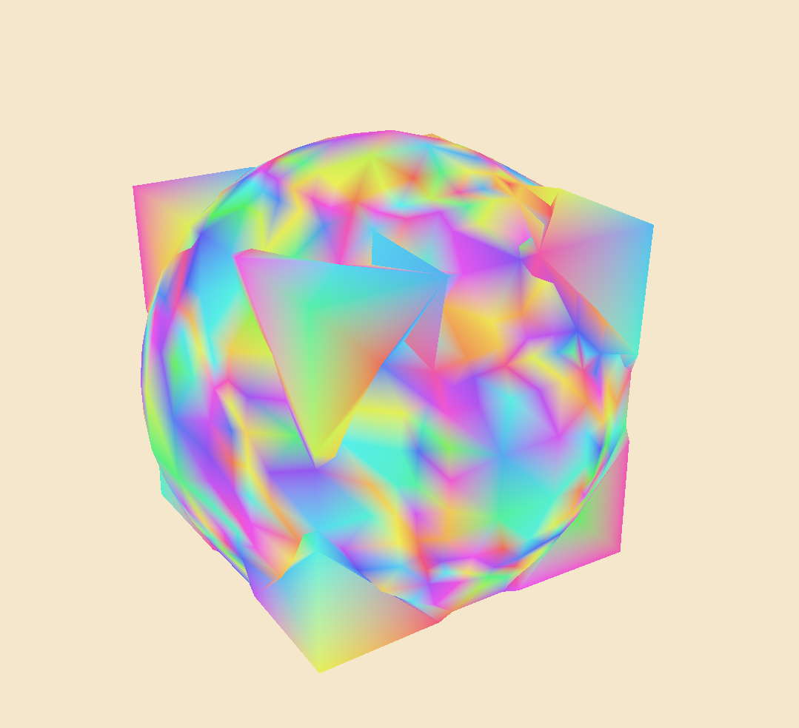

# Conjure
### About

Conjure is a 3D Constructive Solid Geometry (CSG) language.

Rough prototype at the moment.

### Conjuring
```
./conjure --resolution 0.5 --bound 8 examples/union.cnj
```

### Example Conjure Lang

```clojure
(union
  ; centered on origin
  (sphere 4)
  ; lower left point & upper right point
  (cube [-3 -3 -3] [3 3 3])
)
```

